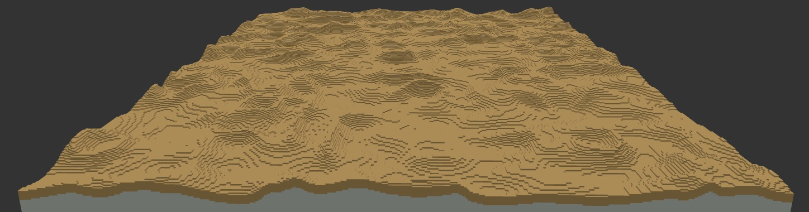

# HeightmapDunes noise2d

**Contributors:** Nevir

For all your desert needs!  It generally works best when the biome's heightmap has a range of about 15 blocks.

## Configuration

**Dune Spacing**: Controls how frequently dunes appear in the overall heightmap.  Larger values means fewer dunes, and more rolling sand in between them.
